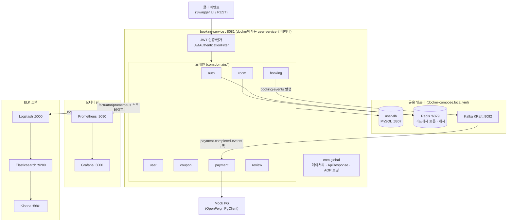
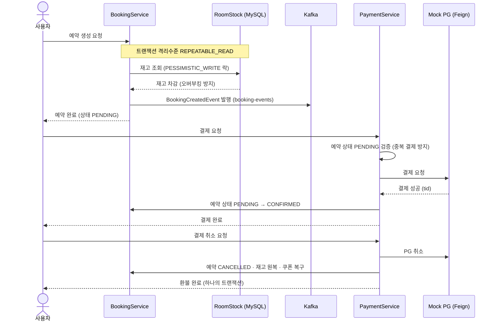

# 🏨 호텔 객실 예약 서비스

> 로그인한 사용자가 호텔 객실을 검색·예약하고, 쿠폰 할인·결제·리뷰까지 이용할 수 있는 서비스입니다.
> 동시 다발적인 예약 요청에도 **오버부킹 없이 안전하게 처리**하는 것을 핵심 목표로 합니다.

Spring Boot 3.2.11 · Java 21 · MSA 4기 최종 프로젝트 (개인)

---

## 📖 목차

- [주요 기능](#-주요-기능)
- [기술 스택](#-기술-스택)
- [아키텍처](#-아키텍처)
- [동시성 처리 전략](#-동시성-처리-전략)
- [실행 방법](#-실행-방법)
- [API 요약](#-api-요약)
- [테스트](#-테스트)
- [문의](#-문의)

---

## ✨ 주요 기능

| 도메인 | 기능 |
|---|---|
| 인증 | JWT 회원가입/로그인, Access + Refresh Token(Redis 저장), 토큰 재발급, 로그아웃 |
| 객실 | 날짜/인원 기준 객실 검색(Redis 캐싱), 어드민 객실 등록/수정/삭제, 날짜별 재고 초기화 |
| 예약 | 예약 생성(재고 확인 + 쿠폰 적용), 목록/상세 조회, 취소 — 비관적 락으로 오버부킹 방지 |
| 쿠폰 | 어드민 쿠폰 생성, 유저 발급(낙관적 락), FIXED/PERCENT 할인, 유효성 검증 |
| 결제 | Mock PG 연동 결제, 결제 성공 시 예약 확정(PENDING → CONFIRMED), 취소 시 환불 + 재고/쿠폰 원복 |
| 리뷰 | 투숙 완료(COMPLETED) 예약 1건당 1회 작성, 수정/삭제, 별점 필터 + 페이징 목록 |

## 🛠 기술 스택

- **Backend**: Java 21, Spring Boot 3.2.11, Spring Data JPA, QueryDSL, MapStruct, Spring Validation
- **인증/보안**: Spring Security, JWT(jjwt), BCrypt
- **DB**: MySQL 8.0, Flyway 마이그레이션, 핵심 쿼리 인덱스 설계
- **캐싱**: Redis (`@Cacheable` 객실 목록, Refresh Token 저장)
- **메시징**: Kafka (예약 생성 이벤트 발행 / 결제 완료 이벤트 구독, 수동 ack)
- **모니터링**: Spring Actuator, Prometheus + Grafana, ELK Stack(Logstash 파이프라인), AOP 요청 로깅
- **인프라**: Docker, docker-compose (`.env`로 환경 변수 분리)
- **테스트**: JUnit5 + Mockito 단위 테스트 49건, E2E 시나리오 스크립트

## 🏗 아키텍처



- 패키지는 `com.domain.{auth,user,room,booking,coupon,payment,review}` 도메인 단위로 분리하고, 각 도메인은 `controller / dto / entity / repository / service (/ event)` 동일 구조를 따릅니다.
- 공통 로직은 `com.global`(security, exception, config, aop, response, entity)에 위치합니다.
- 전체 스택(`msa-hotel-service/docker-compose.yml`)에는 향후 바운디드 컨텍스트 분리를 대비한 예비 DB(booking-db :3308, stock-db :3309, payment-db :3310)도 정의되어 있으며, 현재 앱은 user-db 단일 데이터소스를 사용합니다.
- **예약 확정 흐름**: 예약 생성 시 PENDING 상태로 저장하고 `booking-events`를 발행합니다. 결제는 `PaymentService.pay()`가 Mock PG 승인 후 같은 트랜잭션에서 예약을 CONFIRMED로 전환합니다. `payment-completed-events` 토픽 컨슈머(수동 ack)는 외부 결제 완료 이벤트를 수신해 예약을 확정하는 경로로 별도 구독 중입니다.

### 예약 → 결제 흐름



## 🔒 동시성 처리 전략

이 프로젝트의 핵심 학습 포인트입니다.

| 지점 | 전략 | 이유 |
|---|---|---|
| 객실 재고 차감 | **비관적 락** `@Lock(PESSIMISTIC_WRITE)` | 인기 객실에 예약이 몰릴 때 충돌이 잦으므로 선점 잠금으로 오버부킹 원천 차단 |
| 쿠폰 수량 차감 | **낙관적 락** `@Version` | 충돌 빈도가 상대적으로 낮아 잠금 비용 없이 버전 충돌 시에만 재시도 |
| 예약 생성 트랜잭션 | 격리 수준 `REPEATABLE_READ` | 재고 확인~차감 사이의 부정합 방지 |
| 결제 실패 | 트랜잭션 전파 옵션 롤백 전략 | 결제 실패 시 예약/재고/쿠폰 상태 원복 |

## 🚀 실행 방법

### 1. 로컬 개발 (앱은 IDE/Gradle로 실행)

```bash
# 공용 인프라 기동 (MySQL, Redis, Kafka)
docker compose -f docker-compose.local.yml up -d

# 앱 실행 (Windows는 .\gradlew.bat)
./gradlew bootRun
```

### 2. 전체 스택 (ELK + Prometheus/Grafana 포함)

```bash
cd ..            # msa-hotel-service/
cp .env.example .env   # 필요 시 값 수정 (없으면 기본값 사용)
docker compose up -d
```

| 서비스 | 주소 |
|---|---|
| API / Swagger | http://localhost:8081/swagger-ui.html |
| Actuator Health | http://localhost:8081/actuator/health |
| Kibana | http://localhost:5601 |
| Grafana | http://localhost:3000 |
| Prometheus | http://localhost:9090 |

DB 스키마는 앱 기동 시 **Flyway**가 자동 적용합니다(`src/main/resources/db/migration/`).

## 📡 API 요약

| 그룹 | 대표 엔드포인트 | 인증 |
|---|---|---|
| Auth | `POST /api/auth/registration` · `login` · `refresh` · `logout` | 불필요(가입/로그인) |
| 객실 | `GET /api/rooms?arrDate=&depDate=&guestCount=` · `GET /api/rooms/{id}` | 불필요 |
| 객실(어드민) | `POST/PUT/DELETE /api/admin/rooms` · `POST /api/admin/rooms/{id}/stock` | ADMIN |
| 예약 | `POST /api/bookings` · `GET /api/bookings` · `POST /api/bookings/{id}/cancel` | 필요 |
| 결제 | `POST /api/payments` · `POST /api/payments/{id}/cancel` | 필요 |
| 쿠폰 | `POST /api/coupons/{id}/issue` · `GET /api/coupons/me` · `POST /api/admin/coupons` | 필요/ADMIN |
| 리뷰 | `POST /api/reviews` · `GET /api/rooms/{id}/reviews?rating=&page=&size=` | 필요/불필요 |

전체 명세는 Swagger UI 및 [PROJECT_GUIDE.md](msa-hotel-service/booking/PROJECT_GUIDE.md) 참고.

## 🧪 테스트

```bash
# 단위 테스트 (서비스 레이어 49케이스)
./gradlew test

# E2E 시나리오 (인프라 + 앱 기동 후)
# 회원가입 → 로그인 → 객실등록 → 재고 → 쿠폰 → 예약 → 결제 → 예약확정(Kafka) → 환불
bash e2e/run-e2e.sh
```

IntelliJ HTTP Client용 시나리오 파일은 [`e2e/hotel-booking-e2e.http`](msa-hotel-service/booking/e2e/hotel-booking-e2e.http)에 있습니다.

## 📬 문의

전필원 — hjpw237@naver.com
